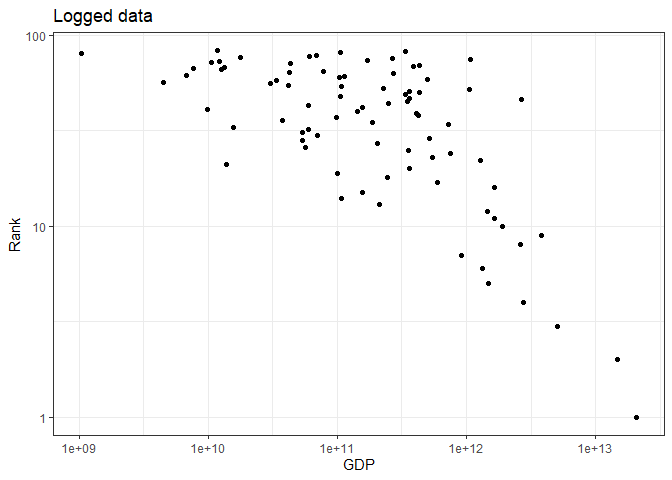
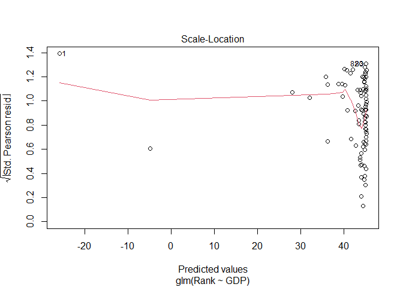
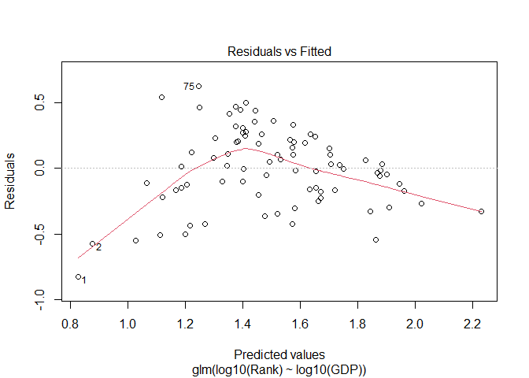
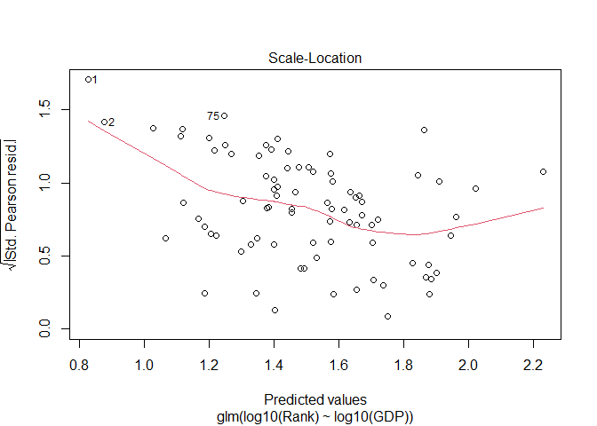
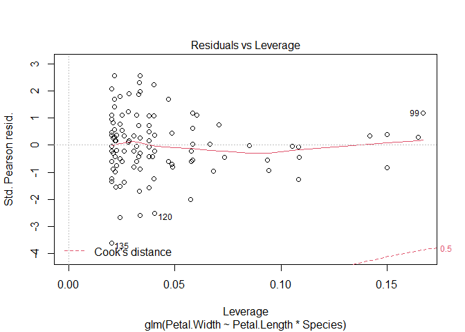
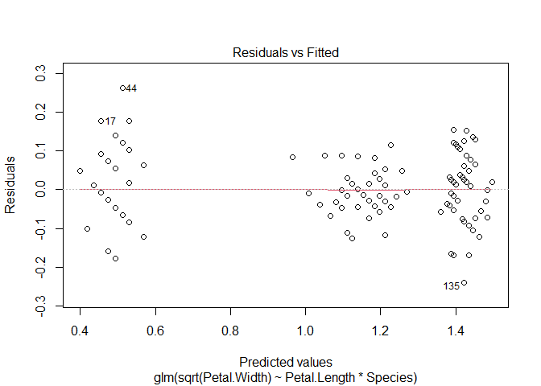
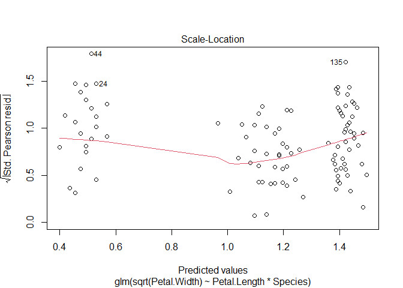
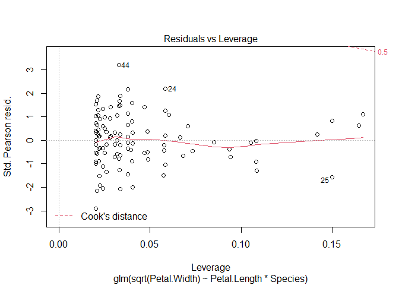

Week 6 Rmarkdown
================

# Part 1 - Tokyo Olympics

## Is there a significant effect of a country’s GDP on their position in the Olympics?

### Installing packages and data

Installing tidyverse and vroom

    ## Warning in as.POSIXlt.POSIXct(Sys.time()): unable to identify current timezone 'C':
    ## please set environment variable 'TZ'

    ## -- Attaching packages --------------------------------------- tidyverse 1.3.1 --

    ## v ggplot2 3.3.5     v purrr   0.3.4
    ## v tibble  3.1.5     v dplyr   1.0.7
    ## v tidyr   1.1.4     v stringr 1.4.0
    ## v readr   2.0.2     v forcats 0.5.1

    ## -- Conflicts ------------------------------------------ tidyverse_conflicts() --
    ## x dplyr::filter() masks stats::filter()
    ## x dplyr::lag()    masks stats::lag()

Install the Tokyo Medals Data:

``` r
Tokyo_Data <- vroom("https://raw.githubusercontent.com/chrit88/Bioinformatics_data/master/Workshop%205/Tokyo%202021%20medals.csv")
```

    ## Rows: 89 Columns: 4

    ## -- Column specification --------------------------------------------------------
    ## Delimiter: ","
    ## chr (1): Country
    ## dbl (3): Gold, Silver, Bronze

    ## 
    ## i Use `spec()` to retrieve the full column specification for this data.
    ## i Specify the column types or set `show_col_types = FALSE` to quiet this message.

Install wbstats for access to the GDP data

install.packages(“wbstats”)

Renaming the column so it is nicer to look at and easier to understand

``` r
my_indicators = c("GDP" = "NY.GDP.MKTP.CD")
```

Extract the GDP data for all countries

``` r
GDP_Raw <- wb_data(my_indicators, 
                    start_date = 2020,
                    end_date = 2020)
```

Having a look at the data

``` r
GDP_Raw
```

    ## # A tibble: 217 x 9
    ##    iso2c iso3c country     date       GDP unit  obs_status footnote last_updated
    ##    <chr> <chr> <chr>      <dbl>     <dbl> <chr> <chr>      <chr>    <date>      
    ##  1 AW    ABW   Aruba       2020  NA       <NA>  <NA>       <NA>     2021-12-16  
    ##  2 AF    AFG   Afghanist~  2020   2.01e10 <NA>  <NA>       <NA>     2021-12-16  
    ##  3 AO    AGO   Angola      2020   5.84e10 <NA>  <NA>       <NA>     2021-12-16  
    ##  4 AL    ALB   Albania     2020   1.49e10 <NA>  <NA>       <NA>     2021-12-16  
    ##  5 AD    AND   Andorra     2020  NA       <NA>  <NA>       <NA>     2021-12-16  
    ##  6 AE    ARE   United Ar~  2020   3.59e11 <NA>  <NA>       <NA>     2021-12-16  
    ##  7 AR    ARG   Argentina   2020   3.89e11 <NA>  <NA>       <NA>     2021-12-16  
    ##  8 AM    ARM   Armenia     2020   1.26e10 <NA>  <NA>       <NA>     2021-12-16  
    ##  9 AS    ASM   American ~  2020   7.09e 8 <NA>  <NA>       <NA>     2021-12-16  
    ## 10 AG    ATG   Antigua a~  2020   1.37e 9 <NA>  <NA>       <NA>     2021-12-16  
    ## # ... with 207 more rows

### Making it neater

It seems as though there are some columns we won’t need, so let us get
rid of those: Getting rid of useless columns from the data set:

``` r
GDP_Data <- subset(GDP_Raw, select = c(1, 2, 3, 4, 5, 9))
# Have a look
GDP_Data
```

    ## # A tibble: 217 x 6
    ##    iso2c iso3c country               date           GDP last_updated
    ##    <chr> <chr> <chr>                <dbl>         <dbl> <date>      
    ##  1 AW    ABW   Aruba                 2020           NA  2021-12-16  
    ##  2 AF    AFG   Afghanistan           2020  20116137326. 2021-12-16  
    ##  3 AO    AGO   Angola                2020  58375976293. 2021-12-16  
    ##  4 AL    ALB   Albania               2020  14887629268. 2021-12-16  
    ##  5 AD    AND   Andorra               2020           NA  2021-12-16  
    ##  6 AE    ARE   United Arab Emirates  2020 358868765175. 2021-12-16  
    ##  7 AR    ARG   Argentina             2020 389288056265. 2021-12-16  
    ##  8 AM    ARM   Armenia               2020  12641209802. 2021-12-16  
    ##  9 AS    ASM   American Samoa        2020    709000000  2021-12-16  
    ## 10 AG    ATG   Antigua and Barbuda   2020   1370281481. 2021-12-16  
    ## # ... with 207 more rows

``` r
# Yay it worked! 
```

## Joining the two data sets:

Now we need to join the so let’s rename one of the GDP_Data rows for the
join:

``` r
GDP_Data_Final<- rename(GDP_Data, code = iso3c)
```

Adding a column to Tokyo Data containing country code:

``` r
library(countrycode)
```

Adding the iso3c column to the Tokyo Data enabling joining later on:

``` r
Tokyo_Data$code <- countrycode(Tokyo_Data$Country, 
                                  origin = "country.name", 
                                  destination = "iso3c")
```

    ## Warning in countrycode_convert(sourcevar = sourcevar, origin = origin, destination = dest, : Some values were not matched unambiguously: Kosovo

Giving China the CHN

``` r
Tokyo_Data$code <- sub("TWN", "CHN", Tokyo_Data$code)
Tokyo_Data$code[42] <- "TWN"
```

Joining the data using inner join :

``` r
GDP_And_Medals_Raw <- inner_join(Tokyo_Data, GDP_Data_Final, by = "code")
GDP_And_Medals_Raw
```

    ## # A tibble: 87 x 10
    ##    Country    Gold Silver Bronze code  iso2c country   date     GDP last_updated
    ##    <chr>     <dbl>  <dbl>  <dbl> <chr> <chr> <chr>    <dbl>   <dbl> <date>      
    ##  1 United S~    39     41     33 USA   US    United ~  2020 2.09e13 2021-12-16  
    ##  2 Republic~    38     32     18 CHN   CN    China     2020 1.47e13 2021-12-16  
    ##  3 Japan        27     14     17 JPN   JP    Japan     2020 5.06e12 2021-12-16  
    ##  4 Great Br~    22     21     22 GBR   GB    United ~  2020 2.76e12 2021-12-16  
    ##  5 Russia       20     28     23 RUS   RU    Russian~  2020 1.48e12 2021-12-16  
    ##  6 Australia    17      7     22 AUS   AU    Austral~  2020 1.33e12 2021-12-16  
    ##  7 Germany      10     11     16 DEU   DE    Germany   2020 3.85e12 2021-12-16  
    ##  8 Italy        10     10     20 ITA   IT    Italy     2020 1.89e12 2021-12-16  
    ##  9 France       10     12     11 FRA   FR    France    2020 2.63e12 2021-12-16  
    ## 10 Netherla~    10     12     14 NLD   NL    Netherl~  2020 9.14e11 2021-12-16  
    ## # ... with 77 more rows

Looks good although we now have NA values too

Remove all of the NA values

``` r
GDP_And_Medals_Final <- na.omit(GDP_And_Medals_Raw)
GDP_And_Medals_Final
```

    ## # A tibble: 83 x 10
    ##    Country    Gold Silver Bronze code  iso2c country   date     GDP last_updated
    ##    <chr>     <dbl>  <dbl>  <dbl> <chr> <chr> <chr>    <dbl>   <dbl> <date>      
    ##  1 United S~    39     41     33 USA   US    United ~  2020 2.09e13 2021-12-16  
    ##  2 Republic~    38     32     18 CHN   CN    China     2020 1.47e13 2021-12-16  
    ##  3 Japan        27     14     17 JPN   JP    Japan     2020 5.06e12 2021-12-16  
    ##  4 Great Br~    22     21     22 GBR   GB    United ~  2020 2.76e12 2021-12-16  
    ##  5 Russia       20     28     23 RUS   RU    Russian~  2020 1.48e12 2021-12-16  
    ##  6 Australia    17      7     22 AUS   AU    Austral~  2020 1.33e12 2021-12-16  
    ##  7 Germany      10     11     16 DEU   DE    Germany   2020 3.85e12 2021-12-16  
    ##  8 Italy        10     10     20 ITA   IT    Italy     2020 1.89e12 2021-12-16  
    ##  9 France       10     12     11 FRA   FR    France    2020 2.63e12 2021-12-16  
    ## 10 Netherla~    10     12     14 NLD   NL    Netherl~  2020 9.14e11 2021-12-16  
    ## # ... with 73 more rows

Ordering the data set based on how the olympic medal table ranking
works:

``` r
GDP_And_Medals_Final <-GDP_And_Medals_Final[order(-GDP_And_Medals_Final$Gold, -GDP_And_Medals_Final$Silver, -GDP_And_Medals_Final$Bronze),]
```

Using the index to give the countries a Rank:

``` r
GDP_And_Medals_Final <- tibble::rowid_to_column(GDP_And_Medals_Final, "Rank")
```

### Getting ready to plot

install the ggplot2 package

``` r
install.packages("ggplot2")
```

    ## Warning: package 'ggplot2' is in use and will not be installed

``` r
# Use the ggplot 2 library 
library(ggplot2)
```

## Plotting

Investigating an initial plot of medal ranking and GDP:

<!-- -->

It looks okay but could do with some logging perhaps of the GDP to make
things more clear.

Pseudo logging the GDP and adding a geom_smooth line

``` r
p2 <- p1 + 
  scale_x_continuous(trans="pseudo_log") + 
    geom_smooth(method="glm")
```

    ## `geom_smooth()` using formula 'y ~ x'

<!-- -->

It looks okay!

## Assessing the fit of a model:

Mod 1 is going to be the “Gaussian” or normally distributed:

``` r
mod1 <- glm(Rank ~ GDP,
                data = GDP_And_Medals_Final,
                family = "gaussian")
```

Mod 2 is going to be the “poisson” type:

``` r
mod2 <- glm(Rank ~ GDP,
            data = GDP_And_Medals_Final,
            family = "poisson")
```

Mod 3 is the Gaussian with the link being log:

``` r
mod3 <- glm(Rank ~ GDP,
            data = GDP_And_Medals_Final,
            family = gaussian(link="log"))
```

Mod 4 is the Gaussian link with inverse link:

``` r
mod4 <- glm(Rank ~ GDP,
            data = GDP_And_Medals_Final,
            family = gaussian(link = "inverse"))
```

Getting library gamlr

``` r
library(gamlr)
```

    ## Loading required package: Matrix

    ## 
    ## Attaching package: 'Matrix'

    ## The following objects are masked from 'package:tidyr':
    ## 
    ##     expand, pack, unpack

Comparing the models:

``` r
AIC_mods <- AIC(mod1,
                mod2,
                mod3,
                mod4)
```

Rank them by AIC using the order() function

``` r
AIC_mods[order(AIC_mods$AIC),]
```

    ##      df       AIC
    ## mod4  3  731.4183
    ## mod3  3  731.5383
    ## mod1  3  754.2027
    ## mod2  2 1242.2560

It looks as though model 4, the gaussian, link = inverse, is slightly
better so lets check that out:

## Investigating our model further:

Now looking at mod4 Create column of log predicted Gaussian

``` r
GDP_And_Medals_Final$pred_gaussian_log <- predict(mod4,
                                        type = "response")
```

Plotting the diagnostics plot for model 4
<!-- --><!-- --><!-- --><!-- -->

Creating a column for residual Gaussian log

``` r
GDP_And_Medals_Final$resid_gaussian_log <- resid(mod4)
```

Plotting with the geom line for the predicted Gaussian log
<!-- -->

Applying the model to the plot (method = glm)

``` r
p3 <-  p3 + 
  scale_x_continuous(trans="log") + 
  geom_smooth(method="glm") +
  xlab("Medal Ranking") +
  ylab("log_GDP") +
  ggtitle( " Logged GDP Data")

p3
```

    ## `geom_smooth()` using formula 'y ~ x'

<!-- -->

I thought this was a good model. There is no residuals plotted but the
data points are clear.

Now having a look at the model summary:

``` r
summary(mod3)
```

    ## 
    ## Call:
    ## glm(formula = Rank ~ GDP, family = gaussian(link = "log"), data = GDP_And_Medals_Final)
    ## 
    ## Deviance Residuals: 
    ##     Min       1Q   Median       3Q      Max  
    ## -36.866  -14.805    0.904   12.977   47.710  
    ## 
    ## Coefficients:
    ##               Estimate Std. Error t value Pr(>|t|)    
    ## (Intercept)  3.998e+00  5.766e-02  69.340  < 2e-16 ***
    ## GDP         -6.442e-13  1.680e-13  -3.835 0.000247 ***
    ## ---
    ## Signif. codes:  0 '***' 0.001 '**' 0.01 '*' 0.05 '.' 0.1 ' ' 1
    ## 
    ## (Dispersion parameter for gaussian family taken to be 375.3847)
    ## 
    ##     Null deviance: 47642  on 82  degrees of freedom
    ## Residual deviance: 30406  on 81  degrees of freedom
    ## AIC: 731.54
    ## 
    ## Number of Fisher Scoring iterations: 7

## This was the solution that you gave which I have adapted to my data:

<!-- -->

Fit a model where neither the x or y are logged:

``` r
mod6 <- glm(Rank ~ GDP, data=GDP_And_Medals_Final)
plot(mod6)
```

<!-- --><!-- --><!-- --><!-- -->
DOESNT LOOK GOOD!

Fit a model where both the x and y are logged:

``` r
mod7 <- glm(log10(Rank) ~ log10(GDP), data=GDP_And_Medals_Final)
plot(mod7)
```

<!-- --><!-- --><!-- --><!-- -->

So, is there an effect?

``` r
summary(mod7)
```

    ## 
    ## Call:
    ## glm(formula = log10(Rank) ~ log10(GDP), data = GDP_And_Medals_Final)
    ## 
    ## Deviance Residuals: 
    ##      Min        1Q    Median        3Q       Max  
    ## -0.82625  -0.17531   0.01719   0.21434   0.62833  
    ## 
    ## Coefficients:
    ##             Estimate Std. Error t value Pr(>|t|)    
    ## (Intercept)  5.17119    0.45305  11.414  < 2e-16 ***
    ## log10(GDP)  -0.32620    0.04016  -8.122 4.32e-12 ***
    ## ---
    ## Signif. codes:  0 '***' 0.001 '**' 0.01 '*' 0.05 '.' 0.1 ' ' 1
    ## 
    ## (Dispersion parameter for gaussian family taken to be 0.0888732)
    ## 
    ##     Null deviance: 13.0614  on 82  degrees of freedom
    ## Residual deviance:  7.1987  on 81  degrees of freedom
    ## AIC: 38.614
    ## 
    ## Number of Fisher Scoring iterations: 2

# Part 2 - Iris

## Is there a positive effect of Petal.Length on Petal.Width?

``` r
data("iris")
library(ggplot2)
```

Plotting the sepal widths so we can visualize if there are differences
between the different species
<!-- -->

Petal length and petal width histograms:

``` r
# 1. Petal Length Histogram
a <- ggplot(iris, aes(x=Petal.Length,
                  fill=Species)) +
  geom_histogram(binwidth=.1, alpha=.5, position = "identity")
  
# 2.Petal Width Histogram
  
b <- ggplot(iris, aes(x=Petal.Width,
                 fill=Species)) +
  geom_histogram(binwidth=.1, alpha=.5, position = "identity")
```


Generate and plot the model:

Investigating the model:

``` r
class(mod1)
```

    ## [1] "glm" "lm"

``` r
plot(mod1)
```

<!-- --><!-- --><!-- --><!-- -->

``` r
summary(mod1)
```

    ## 
    ## Call:
    ## glm(formula = Petal.Width ~ Petal.Length * Species, family = "gaussian", 
    ##     data = iris)
    ## 
    ## Deviance Residuals: 
    ##     Min       1Q   Median       3Q      Max  
    ## -0.6337  -0.0744  -0.0134   0.0866   0.4503  
    ## 
    ## Coefficients:
    ##                                Estimate Std. Error t value Pr(>|t|)    
    ## (Intercept)                    -0.04822    0.21472  -0.225 0.822627    
    ## Petal.Length                    0.20125    0.14586   1.380 0.169813    
    ## Speciesversicolor              -0.03607    0.31538  -0.114 0.909109    
    ## Speciesvirginica                1.18425    0.33417   3.544 0.000532 ***
    ## Petal.Length:Speciesversicolor  0.12981    0.15550   0.835 0.405230    
    ## Petal.Length:Speciesvirginica  -0.04095    0.15291  -0.268 0.789244    
    ## ---
    ## Signif. codes:  0 '***' 0.001 '**' 0.01 '*' 0.05 '.' 0.1 ' ' 1
    ## 
    ## (Dispersion parameter for gaussian family taken to be 0.03144043)
    ## 
    ##     Null deviance: 86.5699  on 149  degrees of freedom
    ## Residual deviance:  4.5274  on 144  degrees of freedom
    ## AIC: -85.391
    ## 
    ## Number of Fisher Scoring iterations: 2

Generating 3 other models:

    ## Warning in dpois(y, mu, log = TRUE): non-integer x = 0.200000

    ## Warning in dpois(y, mu, log = TRUE): non-integer x = 0.200000

    ## Warning in dpois(y, mu, log = TRUE): non-integer x = 0.200000

    ## Warning in dpois(y, mu, log = TRUE): non-integer x = 0.200000

    ## Warning in dpois(y, mu, log = TRUE): non-integer x = 0.200000

    ## Warning in dpois(y, mu, log = TRUE): non-integer x = 0.400000

    ## Warning in dpois(y, mu, log = TRUE): non-integer x = 0.300000

    ## Warning in dpois(y, mu, log = TRUE): non-integer x = 0.200000

    ## Warning in dpois(y, mu, log = TRUE): non-integer x = 0.200000

    ## Warning in dpois(y, mu, log = TRUE): non-integer x = 0.100000

    ## Warning in dpois(y, mu, log = TRUE): non-integer x = 0.200000

    ## Warning in dpois(y, mu, log = TRUE): non-integer x = 0.200000

    ## Warning in dpois(y, mu, log = TRUE): non-integer x = 0.100000

    ## Warning in dpois(y, mu, log = TRUE): non-integer x = 0.100000

    ## Warning in dpois(y, mu, log = TRUE): non-integer x = 0.200000

    ## Warning in dpois(y, mu, log = TRUE): non-integer x = 0.400000

    ## Warning in dpois(y, mu, log = TRUE): non-integer x = 0.400000

    ## Warning in dpois(y, mu, log = TRUE): non-integer x = 0.300000

    ## Warning in dpois(y, mu, log = TRUE): non-integer x = 0.300000

    ## Warning in dpois(y, mu, log = TRUE): non-integer x = 0.300000

    ## Warning in dpois(y, mu, log = TRUE): non-integer x = 0.200000

    ## Warning in dpois(y, mu, log = TRUE): non-integer x = 0.400000

    ## Warning in dpois(y, mu, log = TRUE): non-integer x = 0.200000

    ## Warning in dpois(y, mu, log = TRUE): non-integer x = 0.500000

    ## Warning in dpois(y, mu, log = TRUE): non-integer x = 0.200000

    ## Warning in dpois(y, mu, log = TRUE): non-integer x = 0.200000

    ## Warning in dpois(y, mu, log = TRUE): non-integer x = 0.400000

    ## Warning in dpois(y, mu, log = TRUE): non-integer x = 0.200000

    ## Warning in dpois(y, mu, log = TRUE): non-integer x = 0.200000

    ## Warning in dpois(y, mu, log = TRUE): non-integer x = 0.200000

    ## Warning in dpois(y, mu, log = TRUE): non-integer x = 0.200000

    ## Warning in dpois(y, mu, log = TRUE): non-integer x = 0.400000

    ## Warning in dpois(y, mu, log = TRUE): non-integer x = 0.100000

    ## Warning in dpois(y, mu, log = TRUE): non-integer x = 0.200000

    ## Warning in dpois(y, mu, log = TRUE): non-integer x = 0.200000

    ## Warning in dpois(y, mu, log = TRUE): non-integer x = 0.200000

    ## Warning in dpois(y, mu, log = TRUE): non-integer x = 0.200000

    ## Warning in dpois(y, mu, log = TRUE): non-integer x = 0.100000

    ## Warning in dpois(y, mu, log = TRUE): non-integer x = 0.200000

    ## Warning in dpois(y, mu, log = TRUE): non-integer x = 0.200000

    ## Warning in dpois(y, mu, log = TRUE): non-integer x = 0.300000

    ## Warning in dpois(y, mu, log = TRUE): non-integer x = 0.300000

    ## Warning in dpois(y, mu, log = TRUE): non-integer x = 0.200000

    ## Warning in dpois(y, mu, log = TRUE): non-integer x = 0.600000

    ## Warning in dpois(y, mu, log = TRUE): non-integer x = 0.400000

    ## Warning in dpois(y, mu, log = TRUE): non-integer x = 0.300000

    ## Warning in dpois(y, mu, log = TRUE): non-integer x = 0.200000

    ## Warning in dpois(y, mu, log = TRUE): non-integer x = 0.200000

    ## Warning in dpois(y, mu, log = TRUE): non-integer x = 0.200000

    ## Warning in dpois(y, mu, log = TRUE): non-integer x = 0.200000

    ## Warning in dpois(y, mu, log = TRUE): non-integer x = 1.400000

    ## Warning in dpois(y, mu, log = TRUE): non-integer x = 1.500000

    ## Warning in dpois(y, mu, log = TRUE): non-integer x = 1.500000

    ## Warning in dpois(y, mu, log = TRUE): non-integer x = 1.300000

    ## Warning in dpois(y, mu, log = TRUE): non-integer x = 1.500000

    ## Warning in dpois(y, mu, log = TRUE): non-integer x = 1.300000

    ## Warning in dpois(y, mu, log = TRUE): non-integer x = 1.600000

    ## Warning in dpois(y, mu, log = TRUE): non-integer x = 1.300000

    ## Warning in dpois(y, mu, log = TRUE): non-integer x = 1.400000

    ## Warning in dpois(y, mu, log = TRUE): non-integer x = 1.500000

    ## Warning in dpois(y, mu, log = TRUE): non-integer x = 1.400000

    ## Warning in dpois(y, mu, log = TRUE): non-integer x = 1.300000

    ## Warning in dpois(y, mu, log = TRUE): non-integer x = 1.400000

    ## Warning in dpois(y, mu, log = TRUE): non-integer x = 1.500000

    ## Warning in dpois(y, mu, log = TRUE): non-integer x = 1.500000

    ## Warning in dpois(y, mu, log = TRUE): non-integer x = 1.100000

    ## Warning in dpois(y, mu, log = TRUE): non-integer x = 1.800000

    ## Warning in dpois(y, mu, log = TRUE): non-integer x = 1.300000

    ## Warning in dpois(y, mu, log = TRUE): non-integer x = 1.500000

    ## Warning in dpois(y, mu, log = TRUE): non-integer x = 1.200000

    ## Warning in dpois(y, mu, log = TRUE): non-integer x = 1.300000

    ## Warning in dpois(y, mu, log = TRUE): non-integer x = 1.400000

    ## Warning in dpois(y, mu, log = TRUE): non-integer x = 1.400000

    ## Warning in dpois(y, mu, log = TRUE): non-integer x = 1.700000

    ## Warning in dpois(y, mu, log = TRUE): non-integer x = 1.500000

    ## Warning in dpois(y, mu, log = TRUE): non-integer x = 1.100000

    ## Warning in dpois(y, mu, log = TRUE): non-integer x = 1.200000

    ## Warning in dpois(y, mu, log = TRUE): non-integer x = 1.600000

    ## Warning in dpois(y, mu, log = TRUE): non-integer x = 1.500000

    ## Warning in dpois(y, mu, log = TRUE): non-integer x = 1.600000

    ## Warning in dpois(y, mu, log = TRUE): non-integer x = 1.500000

    ## Warning in dpois(y, mu, log = TRUE): non-integer x = 1.300000

    ## Warning in dpois(y, mu, log = TRUE): non-integer x = 1.300000

    ## Warning in dpois(y, mu, log = TRUE): non-integer x = 1.300000

    ## Warning in dpois(y, mu, log = TRUE): non-integer x = 1.200000

    ## Warning in dpois(y, mu, log = TRUE): non-integer x = 1.400000

    ## Warning in dpois(y, mu, log = TRUE): non-integer x = 1.200000

    ## Warning in dpois(y, mu, log = TRUE): non-integer x = 1.300000

    ## Warning in dpois(y, mu, log = TRUE): non-integer x = 1.200000

    ## Warning in dpois(y, mu, log = TRUE): non-integer x = 1.300000

    ## Warning in dpois(y, mu, log = TRUE): non-integer x = 1.300000

    ## Warning in dpois(y, mu, log = TRUE): non-integer x = 1.100000

    ## Warning in dpois(y, mu, log = TRUE): non-integer x = 1.300000

    ## Warning in dpois(y, mu, log = TRUE): non-integer x = 2.500000

    ## Warning in dpois(y, mu, log = TRUE): non-integer x = 1.900000

    ## Warning in dpois(y, mu, log = TRUE): non-integer x = 2.100000

    ## Warning in dpois(y, mu, log = TRUE): non-integer x = 1.800000

    ## Warning in dpois(y, mu, log = TRUE): non-integer x = 2.200000

    ## Warning in dpois(y, mu, log = TRUE): non-integer x = 2.100000

    ## Warning in dpois(y, mu, log = TRUE): non-integer x = 1.700000

    ## Warning in dpois(y, mu, log = TRUE): non-integer x = 1.800000

    ## Warning in dpois(y, mu, log = TRUE): non-integer x = 1.800000

    ## Warning in dpois(y, mu, log = TRUE): non-integer x = 2.500000

    ## Warning in dpois(y, mu, log = TRUE): non-integer x = 1.900000

    ## Warning in dpois(y, mu, log = TRUE): non-integer x = 2.100000

    ## Warning in dpois(y, mu, log = TRUE): non-integer x = 2.400000

    ## Warning in dpois(y, mu, log = TRUE): non-integer x = 2.300000

    ## Warning in dpois(y, mu, log = TRUE): non-integer x = 1.800000

    ## Warning in dpois(y, mu, log = TRUE): non-integer x = 2.200000

    ## Warning in dpois(y, mu, log = TRUE): non-integer x = 2.300000

    ## Warning in dpois(y, mu, log = TRUE): non-integer x = 1.500000

    ## Warning in dpois(y, mu, log = TRUE): non-integer x = 2.300000

    ## Warning in dpois(y, mu, log = TRUE): non-integer x = 1.800000

    ## Warning in dpois(y, mu, log = TRUE): non-integer x = 2.100000

    ## Warning in dpois(y, mu, log = TRUE): non-integer x = 1.800000

    ## Warning in dpois(y, mu, log = TRUE): non-integer x = 1.800000

    ## Warning in dpois(y, mu, log = TRUE): non-integer x = 1.800000

    ## Warning in dpois(y, mu, log = TRUE): non-integer x = 2.100000

    ## Warning in dpois(y, mu, log = TRUE): non-integer x = 1.600000

    ## Warning in dpois(y, mu, log = TRUE): non-integer x = 1.900000

    ## Warning in dpois(y, mu, log = TRUE): non-integer x = 2.200000

    ## Warning in dpois(y, mu, log = TRUE): non-integer x = 1.500000

    ## Warning in dpois(y, mu, log = TRUE): non-integer x = 1.400000

    ## Warning in dpois(y, mu, log = TRUE): non-integer x = 2.300000

    ## Warning in dpois(y, mu, log = TRUE): non-integer x = 2.400000

    ## Warning in dpois(y, mu, log = TRUE): non-integer x = 1.800000

    ## Warning in dpois(y, mu, log = TRUE): non-integer x = 1.800000

    ## Warning in dpois(y, mu, log = TRUE): non-integer x = 2.100000

    ## Warning in dpois(y, mu, log = TRUE): non-integer x = 2.400000

    ## Warning in dpois(y, mu, log = TRUE): non-integer x = 2.300000

    ## Warning in dpois(y, mu, log = TRUE): non-integer x = 1.900000

    ## Warning in dpois(y, mu, log = TRUE): non-integer x = 2.300000

    ## Warning in dpois(y, mu, log = TRUE): non-integer x = 2.500000

    ## Warning in dpois(y, mu, log = TRUE): non-integer x = 2.300000

    ## Warning in dpois(y, mu, log = TRUE): non-integer x = 1.900000

    ## Warning in dpois(y, mu, log = TRUE): non-integer x = 2.300000

    ## Warning in dpois(y, mu, log = TRUE): non-integer x = 1.800000

Comparing the models using the Akaike’s Information Criterion (AIC)

Ranking them them by AIC using the order() function

``` r
AIC_mods[order(AIC_mods$AICc),]
```

    ##   model      AICc
    ## 2  mod2 -84.80660
    ## 1  mod1 -84.60212
    ## 4  mod4 -84.38363
    ## 3  mod3       Inf

It looks as though model 1 is the most appropriate in this case.

Returning the predicted gaussian and residual gaussian and adding them
as columns:

``` r
# predicted gaussian:
iris$pred_gaussian <- predict(mod1,
                                    type="response")

# returning the residual gaussian: 
iris$resid_gaussian <- resid(mod1)
```

## Making a plot

    ## `geom_smooth()` using formula 'y ~ x'

<!-- -->

## Starting Again:

Data vizualisation:

``` r
iris1 <- ggplot(iris, aes(x = Petal.Length, y = Petal.Width)) + 
  geom_point(aes(col = Species)) +
  theme_bw()

iris1
```

<!-- -->

``` r
iris1 + geom_smooth(aes(col = Species), method="lm")
```

    ## `geom_smooth()` using formula 'y ~ x'

<!-- -->

Running model one

Set a 2x2 plot area, so we get a single pannel with 4 plots:

The qqplot looks a bit uneven
<!-- --><!-- --><!-- --><!-- -->

What about square root?

This looks much better:

``` r
plot(mod3)
```

<!-- --><!-- --><!-- --><!-- -->

``` r
summary(mod3)
```

    ## 
    ## Call:
    ## glm(formula = sqrt(Petal.Width) ~ Petal.Length * Species, data = iris)
    ## 
    ## Deviance Residuals: 
    ##      Min        1Q    Median        3Q       Max  
    ## -0.23961  -0.04583  -0.00825   0.04838   0.26267  
    ## 
    ## Coefficients:
    ##                                Estimate Std. Error t value Pr(>|t|)    
    ## (Intercept)                     0.20974    0.10091   2.079  0.03943 *  
    ## Petal.Length                    0.18887    0.06855   2.755  0.00662 ** 
    ## Speciesversicolor               0.31788    0.14821   2.145  0.03365 *  
    ## Speciesvirginica                0.89496    0.15704   5.699 6.57e-08 ***
    ## Petal.Length:Speciesversicolor -0.04317    0.07308  -0.591  0.55565    
    ## Petal.Length:Speciesvirginica  -0.13206    0.07186  -1.838  0.06816 .  
    ## ---
    ## Signif. codes:  0 '***' 0.001 '**' 0.01 '*' 0.05 '.' 0.1 ' ' 1
    ## 
    ## (Dispersion parameter for gaussian family taken to be 0.006943608)
    ## 
    ##     Null deviance: 24.42219  on 149  degrees of freedom
    ## Residual deviance:  0.99988  on 144  degrees of freedom
    ## AIC: -311.93
    ## 
    ## Number of Fisher Scoring iterations: 2
