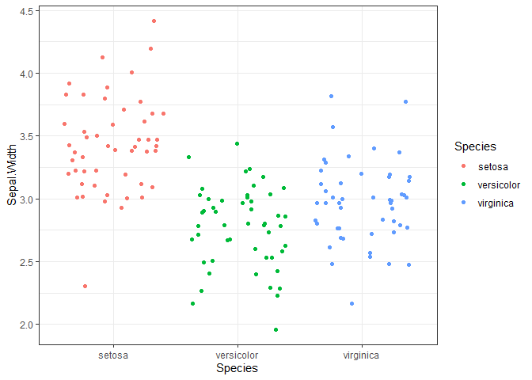

Practical 5
================

# Statistics in R

# 1 Pre-sessaion reading

### Learning Objectives

Today we are going to: + Refresh some basic statistics (normal
distribution, comparing means, etc). - Learn what a GLM is, and how it
relates to simple statistics like linear regressions + Learn what error
distributions are  
+ Learn what link functions are  
+ Learn what to do when we don’t have normally distributed data  
+ Learn what error distributions should be considered for count data  
+ Learn how to fit a GLM  
+ Learn how to visualise residuals (difference between predicted and
observed)  
+ Learn how to tell if a model is fitting our data well  
+ Learn how to explore alternative models  
+ Learn how to compare models  
+ Learn how to interpret model summaries

## 1.1 Statistics in R

### Re-cap

Remember:  
+ Hypothesis testing and the Null hypothesis  
+ The normal/gaussian distribution  
+ The difference between the x and y variables  
+ The concept of a “best fit line”  
+ The concept of a linear regression  
+ The difference between categorical and continuous data  
+ The terms predictor variable, response variable, variance, residuals,
slope

## 1.2 GLM

### Generalised Linear Models:

These are powerful as they allow you to specify the error distribution
of your model (e.g. gaussian, poisson, etc) and link function
(e.g. identity, log, etc). The errors can also be either normally or
non-normally distributed which is a crucial element

# 2. Practical

## 2.1 GLM with categorical predictors

loading the iris data set: data(“iris”)

Plot the sepal widths so we can visualise if there are differences
between the different species

``` r
library(ggplot2)
```

``` r
ggplot(iris, aes( x = Species, y=Sepal.Width)) + geom_jitter(aes(col = Species)) + theme_bw()
```

<!-- -->

Fab, it looks as though there are some differences between the species,
especially between setosa and the other two… We not want to compare the
variance and the means of Sepal.Width between the three species to
establish if these differences are down to chance or whether probability
suggests taht these differences are really there between the species.
